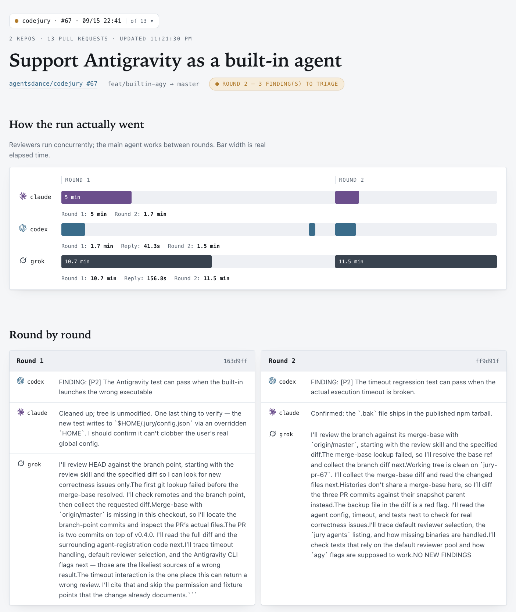
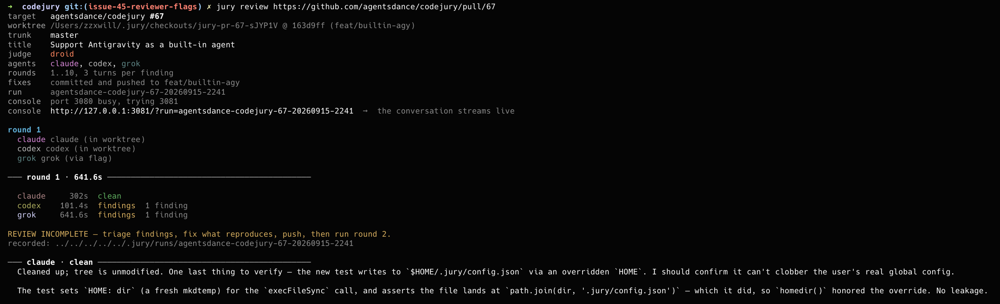
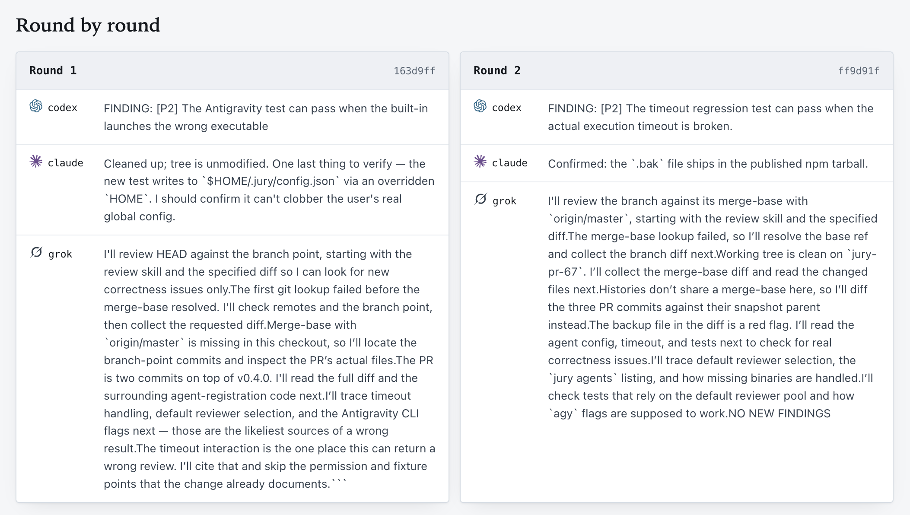
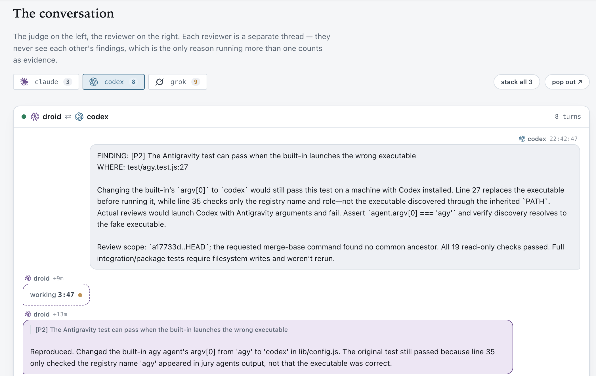

# Code Jury

**Independent AI reviewers. One judge. A review you can follow.**

[](https://github.com/agentsdance/codejury/actions/workflows/ci.yml)
[](https://www.npmjs.com/package/@agentsdance/codejury)
[](LICENSE)

Code Jury is a local CLI that asks independent coding agents to review a pull request,
then lets one judge reproduce findings, apply fixes, and ask the reviewers to check again.
Follow each conversation in a browser console, with prompts, reports, verdicts, and commits saved locally.
It also reviews related PRs across repositories as one coordinated task.

[Download the interactive console demo](docs/console-demo.html) and open the HTML file in a browser.
It uses illustrative data and does not start agents.

## Supported code agents

|  | Code agent | CLI name | Default role |
|:--:|---|---|---|
|  | OpenAI Codex | `codex` | Main agent (judge) |
|  | Anthropic Claude Code | `claude` | Reviewer |
|  | xAI Grok | `grok` | Reviewer |
|  | Factory Droid | `droid` | Reviewer |
|  | Google Antigravity | `agy` | Reviewer |
|  | OpenCode | `opencode` | Opt-in |
|  | Qwen Code | `qwen` | Opt-in |
|  | GitHub Copilot CLI | `copilot` | Opt-in |
|  | Cursor Agent CLI | `cursor` | Opt-in |
|  | Sourcegraph Amp | `amp` | Opt-in |
|  | Moonshot Kimi Code CLI | `kimi` | Opt-in |
|  | TRAE CLI | `trae` | Opt-in |

**Opt-in** agents are fully supported as reviewers and judges, but stay out of the default pool so
a fresh install does not require every CLI to be present. Select one by name — no configuration
needed. See [Built-in agents](#built-in-agents) for install commands.

Install and authenticate each agent's CLI separately. Run `jury agents` to see
which enabled agents are installed (`ok`) or missing (`MISSING`). Any enabled
agent can be selected as a reviewer with `--jury <name>` or as the main agent
with `--judge <name>`; the same agent cannot fill both roles in one review.
Additional CLIs can be added through [custom agent configuration](docs/configuration.md#custom-agent).

## Quick start

You need Node.js 20+, Git, and authenticated coding-agent CLIs. GitHub PRs also need
[GitHub CLI](https://cli.github.com/) (`gh auth login`) and Git credentials that can clone the repository.
With one installed supported CLI, Jury automatically uses it as both judge and jury.
With two, it randomly assigns one as judge and the other as jury. Explicit role settings take precedence.
Agent installation, login, subscriptions, and usage charges are separate from Code Jury.

```sh
npm install -g @agentsdance/codejury
jury agents
jury review https://github.com/OWNER/REPO/pull/123 --push=false
```

Replace the example URL with your PR. `jury agents` lists configured executables and roles;
it checks installation, not authentication or available quota. Authenticate each selected agent
using its own CLI before the review. The selected judge and juries are printed before agents start,
and automatic assignments are saved for replies and resume.

**Reviews can edit files and create commits. Pushing is enabled by default.**
`--push=false` disables Jury's pushes; it is not a read-only mode or an agent sandbox.
Single-PR URL checkouts are temporary and removed on completion; for durable local-only fixes,
use your own checkout without a URL. See [state and retention](docs/usage.md).
The console opens automatically and stays up after the review; press Ctrl-C when finished.
For terminal-only use, add `--web=false`.

```text
jury agents                           # installed executables and configured roles
jury review <pr-url> --push=false      # review and fix without pushing
jury review <pr-url>                   # review, fix, commit, and push
jury runs --dir ""                    # list saved URL-based reviews
jury --web-only --dir ""               # reopen their console
jury help review                      # complete review options
```

`jury <pr-url>` is shorthand for `jury review <pr-url>`. You can also run without installing:
`npx @agentsdance/codejury review <pr-url> --reviewer claude --push=false`.

## Screenshots

A review of Code Jury PR #67, with Droid judging and Claude, Codex, and Grok reviewing.
The dashboard shows elapsed time per agent and findings across rounds.



<details>
<summary>Terminal review output</summary>

The CLI shows the target PR, judge, reviewers, console URL, and first-round results.



</details>

<details>
<summary>Round-by-round findings</summary>

Compare each reviewer's report across successive commits.



</details>

<details>
<summary>Judge–reviewer conversation</summary>

Follow a finding from the reviewer's report to the judge's reproduction and response.



</details>

## How it works

1. Resolve the PR's base branch and head commit into an isolated checkout.
2. Run selected reviewers concurrently. Each reports independently.
3. Let one judge investigate each finding and record a verdict. Accepting a finding requires reproduction evidence and a test description.
4. Commit fixes and, unless disabled, push to the source branch. Send each reviewer feedback about its own findings.
5. Repeat until reviewers agree and no findings remain open, or the round limit is reached.

Agent agreement is a review result, not proof that code is defect-free. The evidence is recorded
so you can inspect it. Judge-provided test evidence is not an independent certification.
The default limit is 10 rounds, with up to three exchanges per disputed finding.

Missing selected executables stop the run before agents start. A reviewer that exits unsuccessfully
stops the loop after the current review or reply round; its failure is saved and never counted as approval.
Fix the installation, login, or quota issue and resume with the same target arguments and `--resume <slug>`.

## Choose your reviewers

```sh
jury review <pr-url> --reviewer claude --reviewer grok
jury review <pr-url> --jury claude,grok
jury review <pr-url> --judge claude --reviewer droid --push=false
```

Use an installed and authenticated Antigravity CLI as a reviewer:

```sh
jury review <pr-url> --jury agy --push=false
```

`jury agents` lists `agy` by default, marked `MISSING` if its executable is not on
`PATH`. Antigravity runs in noninteractive print mode with automatic tool approval;
see [configuration and permissions](docs/configuration.md).

Set a judge once for all repositories:

```bash
jury agents judge claude    # save the global default
jury agents judge          # show the saved default
jury agents judge --reset  # remove it
```

Saved in `~/.jury/config.json`. Precedence: explicit `--judge`, repository `main`
role, global setting, then Codex. `jury agents` shows effective roles in the
current directory. The judge must be enabled in the target repository; custom
agent commands still need configuration in each repository that uses them.

`--reviewer` and `--jury` accept repeated flags and comma-separated names. The selected judge
is excluded from the reviewer pool.
Without an explicit selection, enabled agents with the reviewer role are used; disable unavailable ones
or select installed reviewers explicitly.

Or save default reviewers once for all repositories:

```bash
jury agents jury claude             # only claude reviews by default
jury agents jury claude,droid,amp   # several; opt-in agents allowed
jury agents jury                    # show them, or pick with a checkbox list in a terminal
jury agents jury --reset            # back to the built-in reviewer pool
```

Saved in `~/.jury/config.json`, next to the global judge. Precedence: `--reviewer`/`--jury`,
repository `reviewer` roles, saved default reviewers, then the built-in pool. A saved list turns
off automatic role assignment, as `--jury` does. The judge is left out of its own review. If a saved
reviewer is later uninstalled or disabled in a repository, the run stops with an error naming the
saved setting rather than reviewing with fewer agents.

### Built-in agents

| name | product | install | default |
|---|---|---|---|
| `codex` | OpenAI Codex | `npm i -g @openai/codex` | judge |
| `claude` | Anthropic Claude Code | `npm i -g @anthropic-ai/claude-code` | reviewer |
| `grok` | xAI Grok | `npm i -g @vibe-kit/grok-cli` | reviewer |
| `droid` | Factory Droid | `curl -fsSL https://app.factory.ai/cli \| sh` | reviewer |
| `agy` | Google Antigravity | see Antigravity's docs | reviewer |
| `qwen` | Qwen Code | `npm i -g @qwen-code/qwen-code` | opt-in |
| `copilot` | GitHub Copilot CLI | `npm i -g @github/copilot` | opt-in |
| `opencode` | OpenCode | `npm i -g opencode-ai` | opt-in |
| `cursor` | Cursor Agent CLI | `curl https://cursor.com/install -fsS \| bash` | opt-in |
| `amp` | Sourcegraph Amp | `npm i -g @sourcegraph/amp` | opt-in |
| `kimi` | Moonshot Kimi Code CLI | `npm i -g @moonshot-ai/kimi-code` | opt-in |
| `trae` | TRAE CLI (`traecli`) | `sh -c "$(curl -fsSL https://trae.cn/trae-cli/install_v2.sh)"` | opt-in |

**Opt-in** agents are fully supported — usable with `--reviewer`, `--jury`, `--judge` and
`jury agents judge` — but stay out of the default pool, so a fresh install does not require every
CLI to be present:

```sh
jury review <pr-url> --jury qwen,amp        # works with no config change
jury agents judge qwen                      # or save one as the default judge
```

Each agent authenticates itself; see its own documentation. `jury agents` lists which are
installed, how to install the ones that are not, and which reviewers have **no read-only mode** —
for those, only the review prompt (not the tool) withholds writes.

Adding a built-in agent is a one-file change; see
[Adding a built-in agent](docs/configuration.md#adding-a-built-in-agent).

Use [`jury.config.example.json`](jury.config.example.json) to configure agents in the target repository.
See [configuration and permissions](docs/configuration.md) for the actual execution boundary and custom commands.

## Review related PRs together

```sh
jury review https://github.com/acme/api/pull/12 https://github.com/acme/client/pull/34 \
  --reviewer claude --push=false
```

Every reviewer sees all supplied PRs, their descriptions, and separate checkouts. The judge can fix
cross-repository problems in the appropriate branches. Findings and commits stay associated with each PR.
The first PR supplies configuration. Omit `--trunk`: each PR has its own base branch.
See [usage and troubleshooting](docs/usage.md) for resume behavior, GitLab limitations, and state directories.

## Data and permissions

- Jury runs agent CLIs on your machine. Those agents may send source code, prompts, and outputs to their providers under your account settings and terms.
- Agents inherit the process environment. Repository configuration defines executable commands; inspect it before running on an unfamiliar repository.
- Read-only intent is enforced only as far as each agent's configured permissions allow. Some built-in/custom agents use broad approval settings. Jury is not a security sandbox.
- Prompts, transcripts, findings, and run metadata are saved under the selected state root. They may contain sensitive source material; review them before sharing.
- The console binds to `127.0.0.1` and has no login. Keep it local. See [SECURITY.md](SECURITY.md).

## Project status and contributing

Code Jury is pre-1.0. CLI changes are recorded in the [changelog](CHANGELOG.md).
CI exercises Node.js 20, 22, and 24 on Linux and macOS, including a fresh package installation.
Windows is experimental; the complete workflow has not been validated there.
External agent services are tested with local fixtures in CI, so provider CLI compatibility still depends on your installed versions.
The Go console prototype is retained for development; the npm CLI is the supported distribution.

[Report a bug](https://github.com/agentsdance/codejury/issues/new/choose) ·
[Contribute](CONTRIBUTING.md) · [Security reports](SECURITY.md) ·
[Case study](CASE-STUDY.md) · [Known limitations](TODO.md)

## Sponsors

Supported by OpenAI's [Codex for Open Source](https://openai.com/form/codex-for-oss/)
program with ChatGPT Pro (20x) access.

## License

[MIT](LICENSE).

### OpenCode

Install [OpenCode](https://opencode.ai/docs/cli/) (`npm install -g opencode-ai`) and run `opencode auth login` to configure a provider. Verified against CLI 1.18.31. Select it with `--reviewer opencode` / `--jury opencode`, `--judge opencode`, or `jury agents judge opencode`.

Reviews use `opencode run --agent plan --format json`; edits, delegation, and outside-directory access are denied. The plan agent may inspect Git through its permitted shell commands; these CLI tool permissions are not an OS sandbox and local OpenCode configuration must be trusted. Judges use the build agent with `--auto` to edit and run checks; explicit permission denials still apply. Both roles run in the target worktree. Replies start fresh with the relevant finding context; Jury never resumes the latest unrelated conversation. Only assistant text events are parsed; malformed output, error events, empty output, failed exits, and timeouts cannot approve a review.

See [agent configuration](docs/configuration.md#authentication-versions-and-conversations) for verified CLI versions, login commands, permission boundaries, and session handling. New agents are opt-in, including OpenCode; select them explicitly or enable them in repository configuration.
